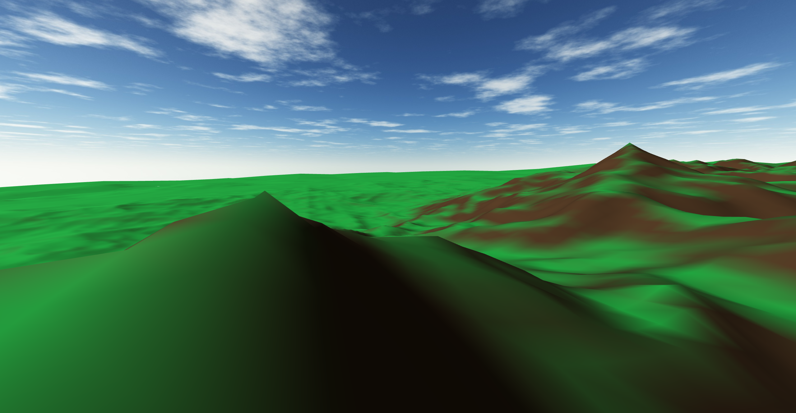
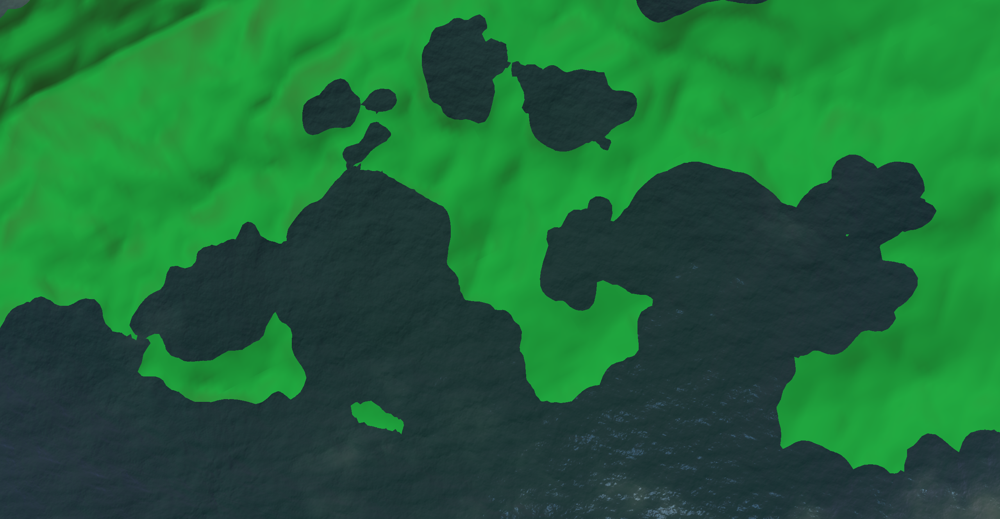
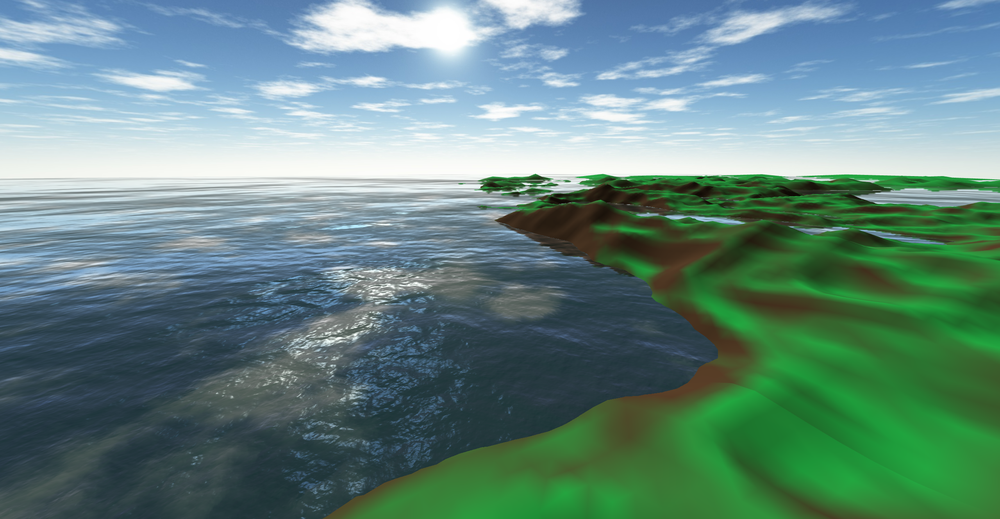

# PseudoSun
A 3D experience that allows you to explore a virtual, procedurally generated world.

## Web App
See it in action at https://pseudosun.ethanvoth.com! PseudoSun is very much a work-in-progress, so see below for instructions on how to use the program currently.

## Screenshots

## Instructions

### Warnings
- Since I have not yet implemented any optimizations, PseudoSun may have performance issues on your computer. In the future I hope to improve the speed and add various performance levels.
- There are no limits on where you can go for now, so don't be alarmed if you find yourself under the ocean or inside a mountain!

### Controls
- **Look:** Use the `mouse` to look around and choose which direction you want to go.
- **Move horizontally:** Hold the `WASD` keys to move forward, left, backwards, and right, respectively.
- **Move vertically:** Hold the `space` key to move up, and the `shift` key to move down.
- **Go faster:** Tap the `W` key multiple times before holding it down to go faster. Each additional tap multiplies the speed by 2.
- **Pause:** Press the `E` key to toggle the menu.

## How it works

### Graphics
To manipulate and render the 3D geometry, it uses the [Three.js](https://threejs.org) 3D graphics library. This allows it to tap into the power of your graphics card directly from the browser (whenever possible).

### Terrain
The terrain consists of a heightmap of points on a (modified) plane. The height for each point is determined by layering various transformations of [Perlin noise](https://en.wikipedia.org/wiki/Perlin_noise) (generated using [noisejs](https://github.com/josephg/noisejs)), which creates an organic, varied landscape. There is an ocean, which only exists at a defined sea level.

### Levels of detail
To reduce the total number of points that need to be rendered, polygons are rendered with higher density nearer to the camera and lower density farther away, before stopping entirely. To achieve this, we create a custom geometry using the following steps:

1. Define a render distance and tile size. The tile size will be the length and width of our "tiles", which are the square units that make up our overall geometry. The render distance will be the maximum distance from the camera at which we will render a tile.
2. For each tile within the render distance, assign it a resolution based on its distance from the camera. This resolution defines how many points make up its geometry, and should therefore be higher the closer we are to the camera.
3. Make a [PlaneGeometry](https://threejs.org/docs/#api/en/geometries/PlaneGeometry) to represent each tile, and merge them to create the overall terrain geometry.
4. For each point in the terrain geometry, update its height, which is determined by layering various transformations of Perlin noise, often by using [fractal Brownian motion](https://thebookofshaders.com/13/).

Steps 1-3 only need to be executed when the program is initiated, and step 4 only happens when the camera has moved into the boundaries of a new tile. (When the camera crosses a tile boundary, it is reset back the length of one tile so that the geometry can remain stationary in virtual space).

### Sky
As of now, the sky is a simple skybox. I hope to improve this in the future by using shaders to simulate the scattering effects of the atmosphere.

## Todo
- Improve form and appearance of terrain, and perhaps add entities such as trees, rocks, grass, etc. in the future.
- Use a scope variable where it would make things easier
- Organize variables in general
- Better comments (utilize JSDoc?)
- Implement optimizations
   - Reuse of height calculations
   - Multiple swapping meshes for asynchronous loading